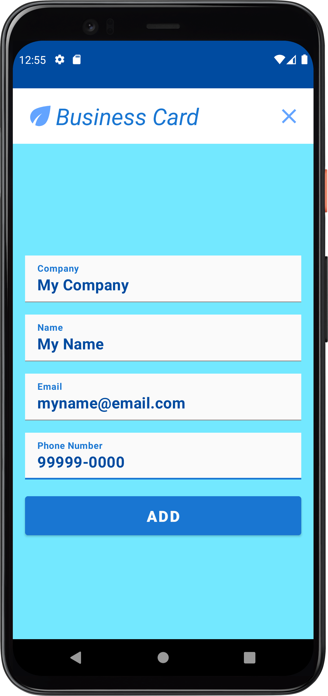
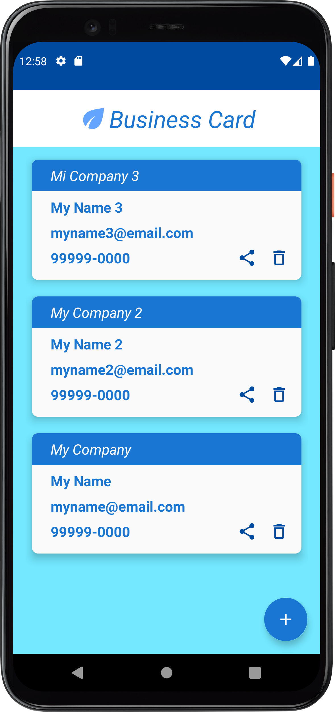

# Businnes Card
## App Android

### I. Sobre

#### Projeto de Desenvolvimento Mobile com Kotlin e Android Nativo para demonstrar os estudos das aulas organizadas pela Digital Innovation One.

#### Desenvolvido na IDE Android Studio, com um conjunto de ferramentas implementadas para facilitar o uso de varias funcionalidades.

#### Aplicativo com uso de banco de dados Room para salvar e excluir os dados de forma mais elegante.

#### App com objetivo de apresentar o uso de Kotlin e Room no Android Nativo.  

### II. Layout do Projeto

<table>
    <tr>
        <td width="200"></td>
        <td width="200"></td>
    </tr>
    <tr>
        <td width="200"></td>
        <td width="200"></td>
    </tr>
</table>

### III. Demonstração de Uso

<table width="100%">
    <tr>
        <td style="border: 1px solid #000">
            
        </td>
    </tr>
</table>

### IV. Tecnologias Utilizadas
#### 1) IDE:
* Android Studio
#### 2) Linguagem de Programação:
* Kotlin
#### 3) Layout:
* Binding View
#### 4) Plugin:
* kotlin-kapt
#### 5) Dependências:
* implementation 'androidx.fragment:fragment-ktx:1.4.1'
* implementation "androidx.lifecycle:lifecycle-extensions:2.2.0"
* implementation "androidx.room:room-runtime:2.4.2"
* implementation "androidx.room:room-ktx:2.4.2"
* annotationProcessor "androidx.room:room-compiler:2.4.2"
* kapt "androidx.room:room-compiler:2.4.2"

### V. Autor
#### Katarine Albuquerque
#### Linkedin: <a href="https://www.linkedin.com/in/katarine-albuquerque/">/katarine-albuquerque</a>
#### GitHub: <a href="https://github.com/KatarineAlbuquerque">/KatarineAlbuquerque</a>
